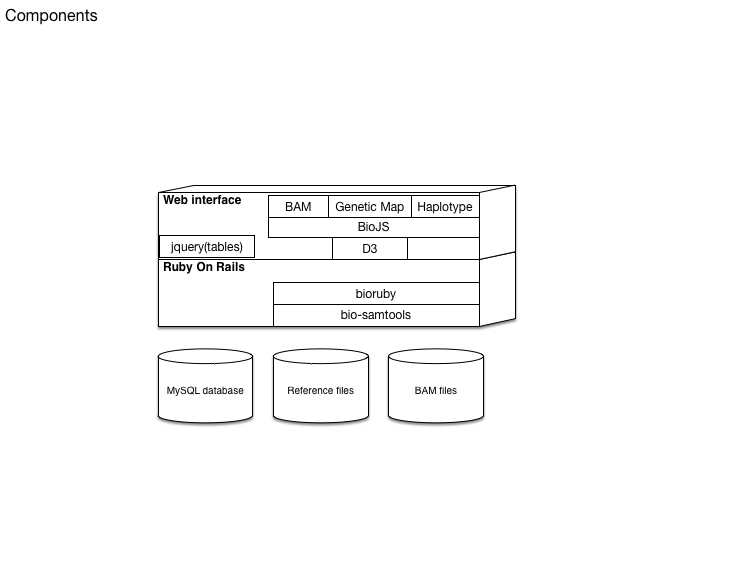
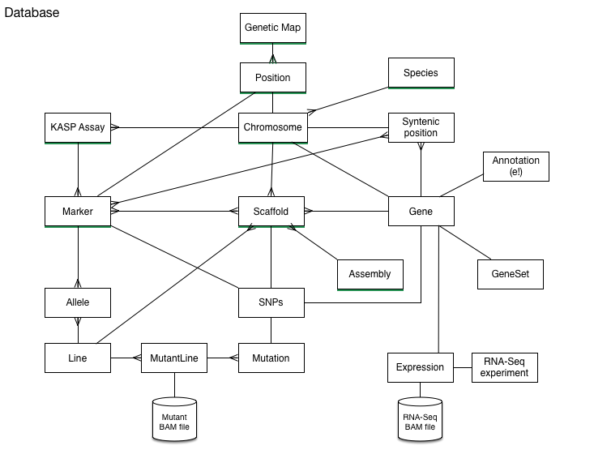
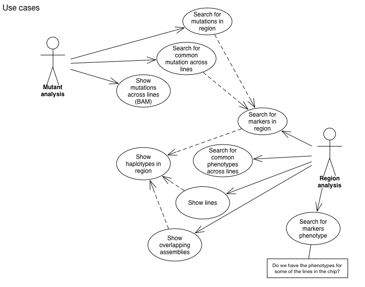

# README 

This database and information system is designed to integrate resources from the wheat community. The initial targets are to integrate:

* Genetic maps
* Genome assemblies
* SNP Markers
* Syntenic genes
* Gene anottation
* PolyMarker

## Architecture

The general components in the system are stacked as follow:

Note: The BAM files may be scrollable.


## Database





## Use case
This are the initial use cases



## Setting up

Once the database is setup via ```rake db:migrate``` there are rake tasks to add teh data

### Adding a genetic map 


```bash
rake "genetic_map:add[:name,:filename,:description,:species]"
```

 * ```:name``` The name of the genetic map
 * ```:filename``` A tab separated column, with four columns ID[string], Chromosome[string], position cM[float], order[int] 

Example:

```csv
Ra_c23068_380 1A 0 1
BobWhite_c48447_529 1A 33.01 2
BS00062658_51 1A 37.14 3
BS00026003_51 1A 38.46 4
BS00071289_51 1A 42.4 5
Excalibur_c9509_1180 1A 42.4 6
GENE-0412_338 1A 42.4 7
IAAV3919 1A 42.4 8
Kukri_c18951_853 1A 42.4 9
RAC875_c42700_264 1A 42.4 10
```

* ```:description``` A short description of the genetic map, may include a doi
* ```:species``` The name of the species. It is optional. Defaults to ```Hexaploid Wheat```


### Adding the marker alignment to scaffolds

To load the positions of the markers, PSL alignments from Blat can be used. Only continous alignments are recorded. 

```marker:load_blat_position ``` 
